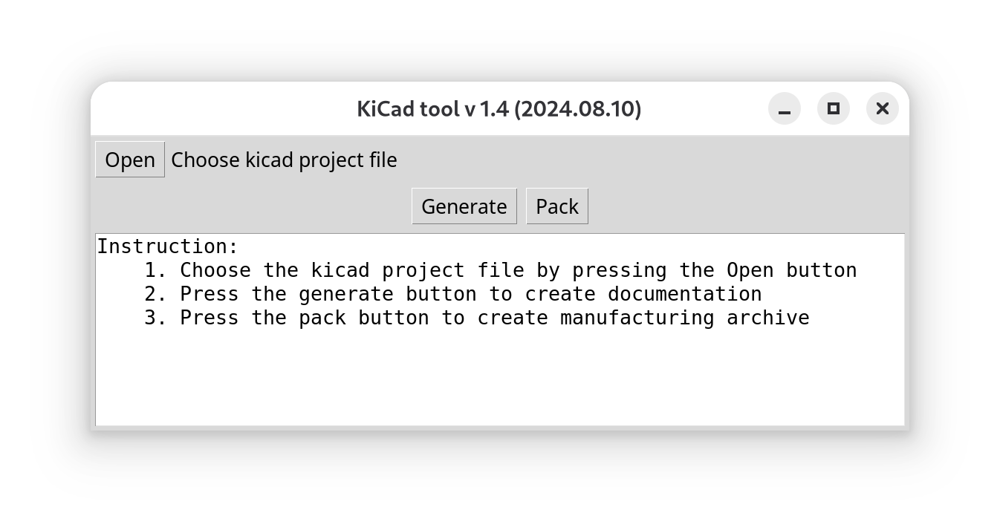
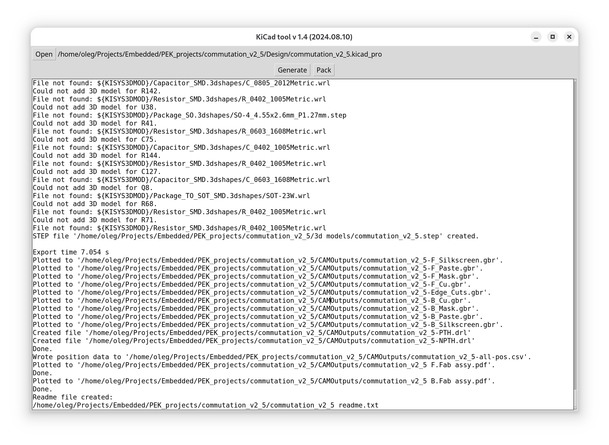
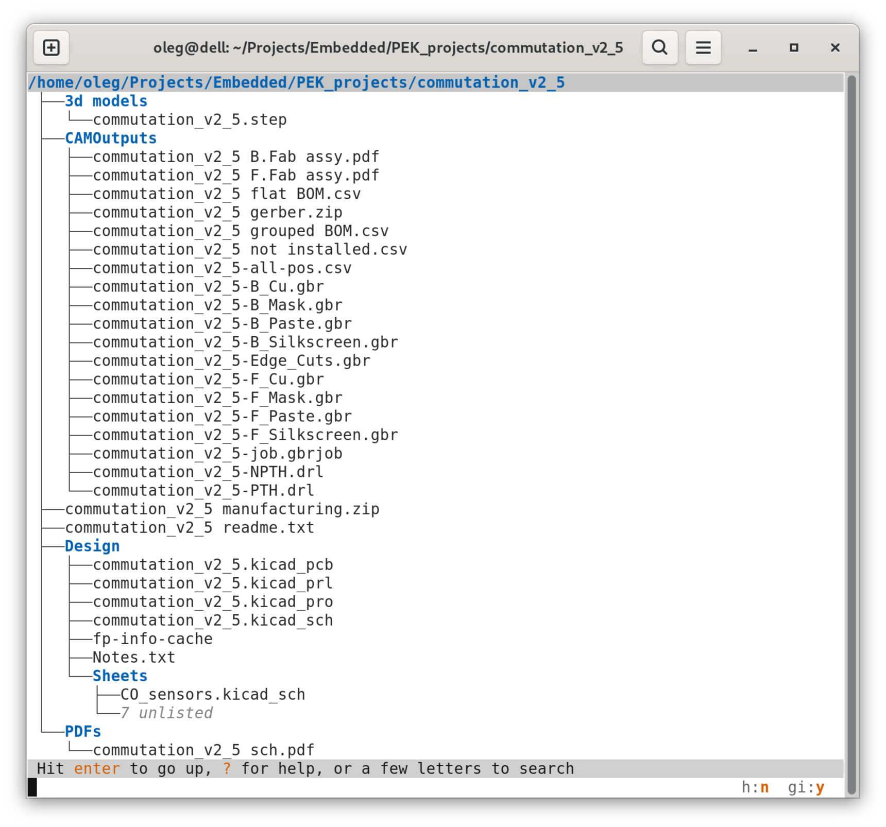
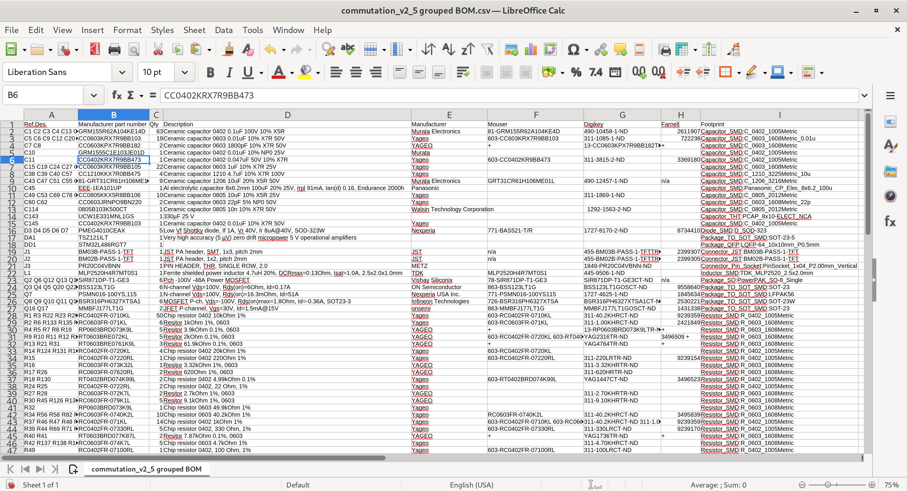
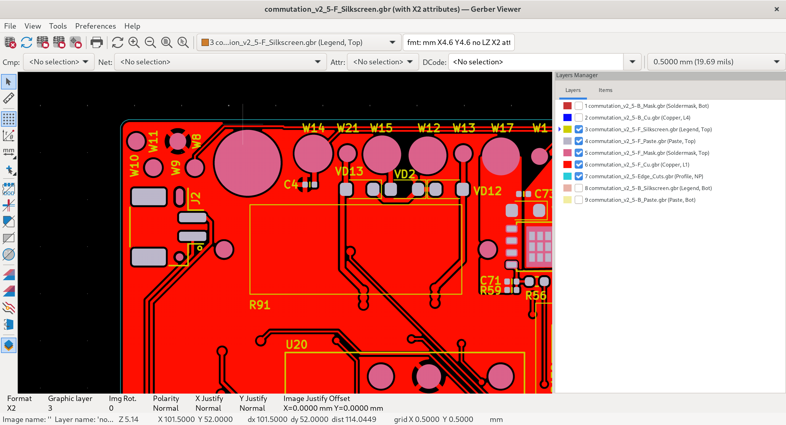
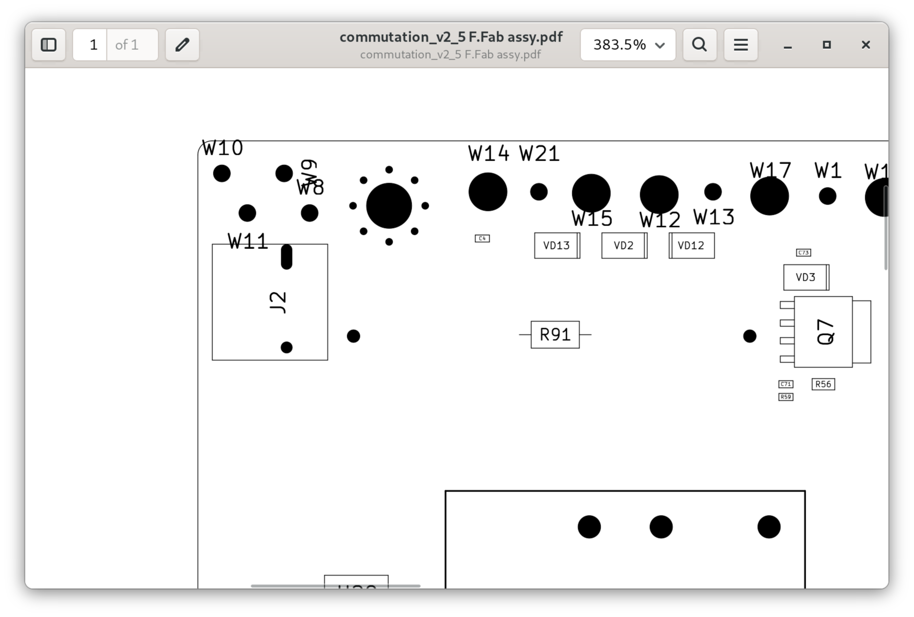
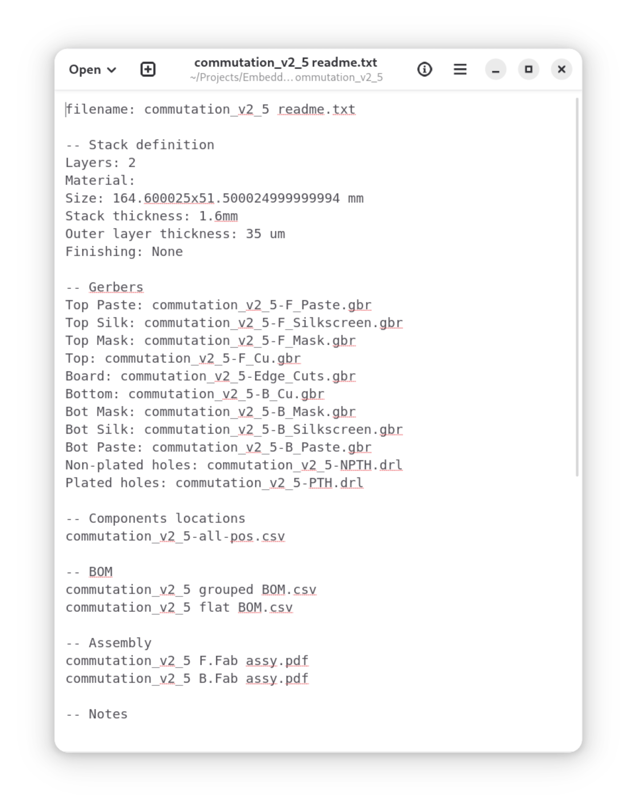
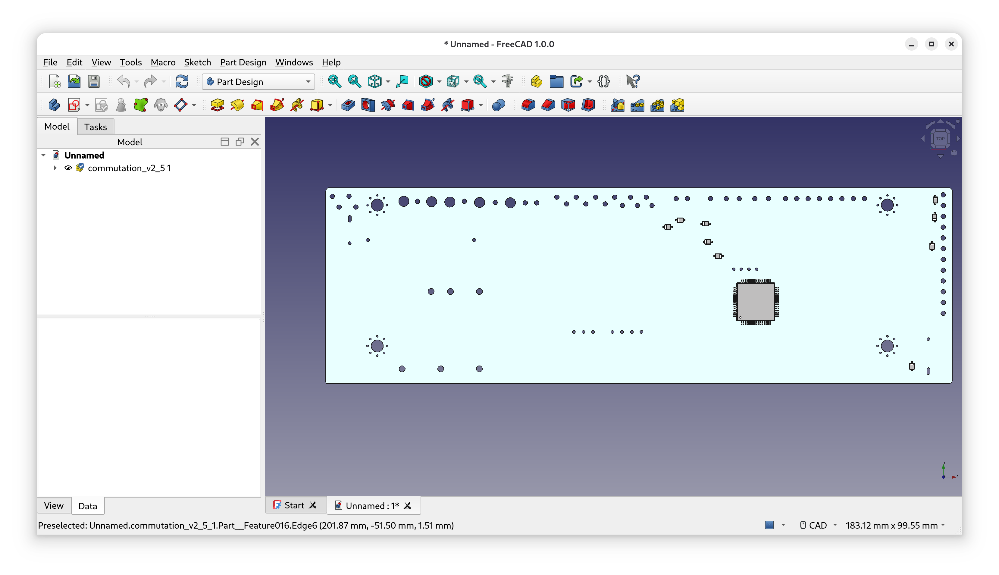

# KiCad Manufacturing Tool

A desktop tool that turns a finished **KiCad** PCB project into a complete, fab-ready
manufacturing package with a single click. It drives `kicad-cli` to export every
production artifact, builds tailored bills of materials, parses the board for a stack-up
specification, and bundles everything into one solid archive ready to send to a
PCB manufacturer / assembly house.

> Built to remove the repetitive, error-prone manual steps between "design is done" and
> "files are at the fab."

---

## Why this exists

Releasing a board to production in KiCad normally means manually exporting gerbers,
drill files, pick-and-place data, a 3D model, schematic and assembly PDFs, then
hand-assembling several BOM variants and writing a layer/stack-up description for the
manufacturer — and repeating all of it for every revision. This tool collapses that
checklist into **two buttons: _Generate_ and _Pack_.**

---

## Features

- **One-click manufacturing export** — drives `kicad-cli` to produce all production data
  from a `.kicad_pro` project.
- **Gerbers & drill files** — per-layer gerbers with soldermask subtraction, plus
  separate plated / non-plated Excellon drill files.
- **Pick-and-place (PnP)** — combined top/bottom position CSV in millimeters.
- **3D model** — STEP export for mechanical review and enclosure design.
- **PDF documentation** — schematic PDF and black-and-white top/bottom assembly
  (fab) drawings.
- **Smart BOM generation** — three coordinated CSV BOMs from the schematic netlist:
  - **Flat BOM** (one component per row),
  - **Grouped BOM** (identical parts merged with quantities, grouped by part number),
  - **Not-installed / DNP list** for DNP and virtual components.
  Columns include manufacturer part number, distributor references (Mouser, Digi-Key,
  Farnell), description and footprint. Components missing a `part_num` are reported as
  warnings so nothing slips through.
- **Automatic stack-up / readme spec** — parses the `.kicad_pcb` file to extract board
  dimensions, copper finish, outer-layer copper thickness, core material and board
  notes, then writes a human-readable manufacturing `readme` describing the stack and
  listing every file in the package.
- **Solid archive packing** — bundles gerbers + drill + PnP into a gerber zip, wraps
  that together with BOMs and assembly drawings into a CAM archive, and finally produces
  a single top-level **manufacturing archive** containing the readme and CAM data.
- **Simple GUI** — a small Tkinter interface with a live log of every step and any
  warnings.
- **KiCad 7 and 8 supported**, configurable `kicad-cli` path, cross-platform
  (Windows / Linux).

---

## How it works

```
 .kicad_pro project
        │
        ▼
┌──────────────────────────────────────────────┐
│  Generate                                      │
│   ├─ sch → python-bom (netlist) → BOM CSVs     │
│   ├─ sch → schematic PDF                        │
│   ├─ pcb → gerbers (per layer)                  │
│   ├─ pcb → drill (plated / non-plated)          │
│   ├─ pcb → pick-and-place CSV                    │
│   ├─ pcb → STEP 3D model                         │
│   ├─ pcb → F/B assembly (fab) PDFs               │
│   └─ pcb parser → stack-up readme.txt            │
└──────────────────────────────────────────────┘
        │
        ▼
┌──────────────────────────────────────────────┐
│  Pack                                          │
│   gerbers+drill+pnp ─► <project> gerber.zip     │
│   + BOMs + assy PDFs ─► <project> CAM.zip        │
│   + readme ──────────► <project> manufacturing.zip │
└──────────────────────────────────────────────┘
```

Output is organized into `CAMOutputs/`, `PDFs/` and `3d models/` folders next to the
project, with the final manufacturing archive placed alongside them.

---










---

## Installation

### Requirements

- **KiCad 7 or 8** (the tool calls the `kicad-cli` executable that ships with KiCad)
- **Python 3.8+**
- Python packages: `pyyaml` (and `tkinter`, which ships with most Python installs)

### Linux

```bash
# Tkinter
sudo apt-get install python3-tk

# YAML
sudo apt-get install python3-yaml      # or: pip install pyyaml
```

### Configuration

Create a `config.yml` file next to the application pointing at your `kicad-cli`
executable (or copy and rename the provided `config_linux.yml`):

```yaml
# Linux example
kicad_cli_path: /bin/kicad-cli
```

```yaml
# Windows example (quote paths that contain spaces)
kicad_cli_path: "C:\Program Files\KiCad\7.0\bin\kicad-cli"
```

If you use the **KiCad AppImage**, `kicad-cli` is a *subcommand* of the AppImage rather
than a standalone binary, so give both the AppImage path and the subcommand, separated by
a space:

```yaml
kicad_cli_path: /home/user/Applications/KiCad.AppImage kicad-cli
```

The value is passed straight to the shell, so quote only the executable path if it
contains spaces (e.g. `"/home/user/My Apps/KiCad.AppImage" kicad-cli`). If KiCad is
installed elsewhere, adjust the path accordingly.

---

## Usage

```bash
python KiCad_tool.py
```

1. Press **Open** and select your `.kicad_pro` project file.
2. Press **Generate** to export all documentation (gerbers, drill, PnP, STEP, PDFs,
   BOMs and the stack-up readme).
3. Press **Pack** to bundle everything into the final manufacturing archive.

The output log reports every step and surfaces warnings (for example, components without
a manufacturer part number).

---

## Project structure

| File | Responsibility |
|------|----------------|
| `KiCad_tool.py` | Tkinter GUI entry point; wires _Open / Generate / Pack_ to the pipeline |
| `kicad_processing_tools.py` | Orchestrates the full generate & pack pipeline |
| `kicad_sch_tools.py` | Schematic exports — netlist and schematic PDF |
| `kicad_pcb_tools.py` | PCB exports — gerbers, drill, PnP, STEP, assembly PDFs |
| `kicad_pcb_parser.py` | Regex parser that extracts board size, material, copper finish, thickness and notes from `.kicad_pcb` |
| `kicad_readme_creator.py` | Builds the human-readable manufacturing / stack-up readme |
| `kicad_bom_writer.py` | Generates grouped / flat / DNP BOM CSVs from the netlist |
| `kicad_netlist_reader.py` | KiCad netlist reader (BOM helper library) |
| `bom_csv_grouped_and_separate_dnp.py` | Standalone BOM script (usable directly inside KiCad) |
| `config_provider.py` | Loads `config.yml` |
| `test_*.py` | Unit tests for the BOM generator and PCB regex parser |

---

## Tech stack

- **Python 3** — application logic
- **Tkinter** — GUI
- **`kicad-cli`** (KiCad 7/8) — driven via `subprocess` for all CAD exports
- **Regular expressions** — lightweight parsing of the KiCad S-expression PCB format
- **`csv` / `zipfile` / `pathlib`** — BOM generation and archive packing
- **PyYAML** — configuration

---

## Notes & roadmap

Known limitations and planned improvements:

- Automatic detection of layer count (currently the stack readme assumes a 2-layer,
  1.6 mm board; 4-layer support is in progress).
- Broader Windows packaging.

---

## License

Released under the [MIT License](LICENSE).
